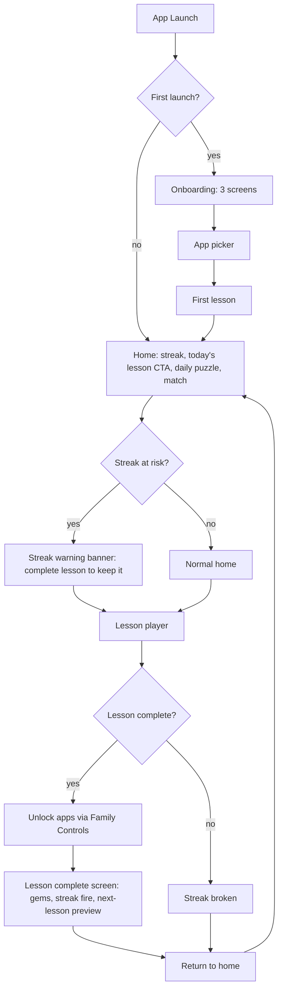
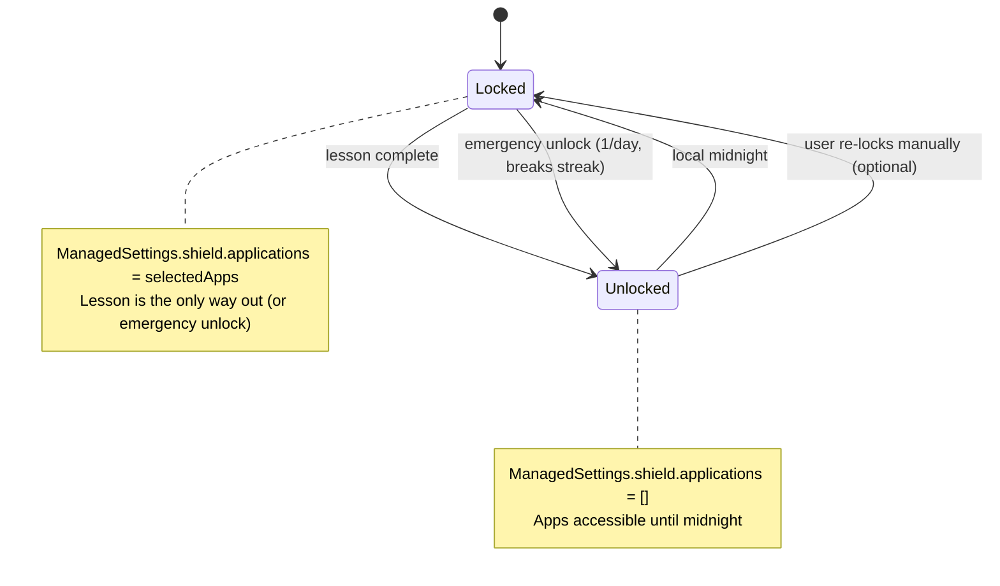
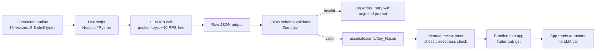
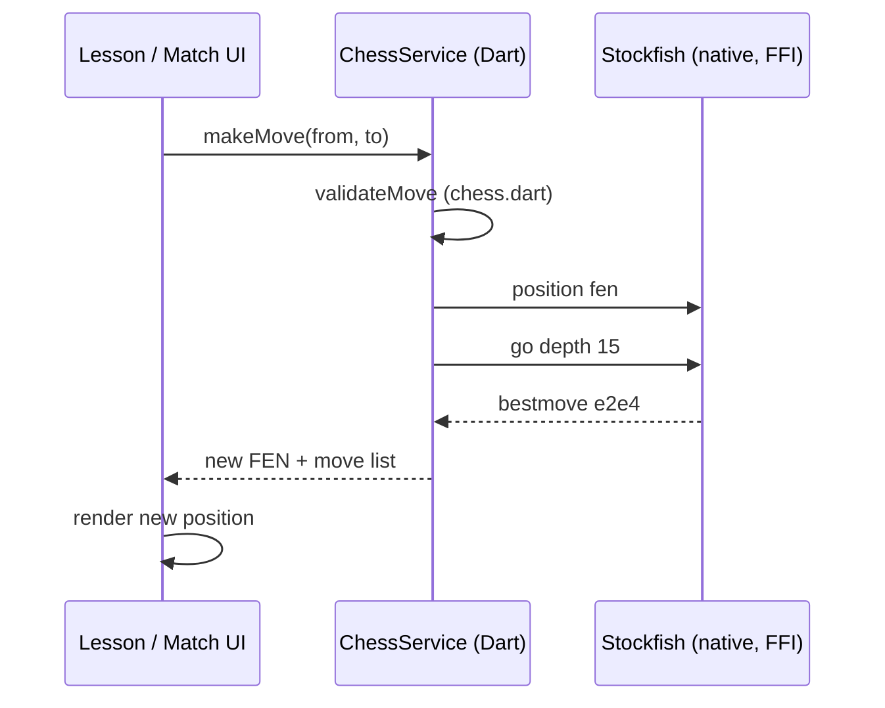

# Chess Duolingo — App Spec & 30-Day MVP Plan

> **Status:** Draft v1 · 2026-06-15
> **Target:** 30-day MVP → TestFlight beta
> **Repo:** `github.com/Unselfisheologism/chess-app` (forked from man-wen, fresh history)
> **Working name:** `chess-app` (rename when branding decided)
> **Platform:** Flutter 3.22 / Dart 3.4 — iOS first, Android second
> **Depth:** Deep (phased delivery)

---

## How to use this plan

- Each **U-N** is one logical commit's worth of work. Ship U1, then U2, etc.
- **U-IDs are stable.** If you split a unit, the original ID stays on the original concept.
- **Test scenarios** are written into the unit. Don't ship a unit until its scenarios pass.
- **Deferred items** at the bottom are real but explicitly out of scope. Do them after MVP ships.
- **Open questions** need your decision before U1 starts.

---

## 0. Strategic frame

### 0.1 The pivot

You're pivoting **away from** man-wen (quit-porn app) and **toward** a chess learning app with social media lock. Reason: the quit-porn niche is ethically fraught for a 15-year-old founder — not because the category is wrong, but because the *cost of being misread* by your parents is high. Man-wen is a real, valid, profitable business; you're not abandoning it because it doesn't work, you're shelving it because the *positioning* doesn't fit your life.

The new app keeps **everything good** about the man-wen build experience (Flutter, MethodChannel-based platform integrations, iOS-first native API work) while landing in a category that is:
- **Ethically clean** — helps people learn, helps people stop doomscrolling. Easy sentence to say to parents.
- **Mass-market** — chess is a global game with 600M+ players, TikTok/Reels native, and proven paid-conversion economics.
- **Reels-virality bait** — "this app blocks my TikTok until I solve a chess puzzle" is the entire hook.
- **Willingness-to-pay** — Duolingo, Brilliant, Chess.com, Headspace all charge $5–15/mo. Nobody expects those to be free.

### 0.2 Locked decisions (from pre-planning discussion)

These three decisions are **architectural** and won't be revisited during execution.

| # | Decision | Choice | Why |
|---|---|---|---|
| D1 | **Lesson UI** | 5–8 hand-built screen templates; LLM generates *content* as JSON at dev-time only | UI is the brand. Consistency builds muscle memory. LLM-generated UI is for agent dashboards, not learning flows. |
| D2 | **Chess play** | Stockfish-NNUE offline (Dart FFI) day 1; Lichess API v2 if real opponents are ever needed | LLMs are bad at chess (≤2000 ELO) and expensive. Stockfish is free, 3500 ELO, runs offline. Multiplayer cold-start is a trap. |
| D3 | **Lock trigger** | Daily lesson completion is the gate. Daily match earns a streak-freeze token (bonus loop, not the gate) | Bypass-proof (user can play chess elsewhere but can't fake a lesson). Frictionless (no wait times). Reinforces *learning*, not just *playing*. |

**OpenUI's role:** None in the user-facing app. Possibly useful as a *dev-time* content-authoring tool to generate lesson JSON faster. Not in MVP scope.

### 0.3 Why this will work

- **Reels virality hook:** "this app blocks my TikTok until I solve a chess puzzle" is the entire Reel. The conflict — *I'm locked out of my phone* — is inherently shareable. Cold Turkey, Opal, Jomo, One Sec all went viral on this exact premise.
- **Daily retention hook:** Streaks (Duolingo model) + lock = the user cannot break the streak without paying the cost (solving the problem). Habit compounds.
- **WTP hook:** Self-improvement and screen-time reduction are two of the highest WTP categories in the app store. $5.99/mo is in the proven range.
- **Multi-modal expansion:** chess → math → music theory → languages, one sub-domain at a time. Each is its own funnel; chess is the wedge.
- **Single-player is fine:** Daily lesson + Stockfish is enough for retention. Real multiplayer is not required for MVP success.

---

## 1. Product

### 1.1 Elevator pitch

> "Duolingo for chess. A daily 10-minute micro-lesson that actually teaches you to play real chess — and locks your social media apps until you finish it. Free for the first 3 days, $5.99/mo after."

### 1.2 Target user

- **Age:** 12–28
- **Behavior:** Plays chess casually OR wants to learn, spends 2+ hours/day on social media (TikTok, Instagram, YouTube, X)
- **History:** Tried Chess.com / YouTube tutorials and bounced off — too much content, no structure, no accountability
- **Don't want:** A "serious chess training app" with engine analysis and opening databases. Want the gamified, friendly, Duolingo feel.

### 1.3 Core jobs

1. **Learn chess progressively** — from "I know how the pieces move" to "I can beat my friend" in 30 days
2. **Replace doomscrolling with learning** — the lock makes the default action *learn*, not *scroll*
3. **Build a daily habit** — streaks make progress feel earned; freeze tokens forgive misses without losing the streak

---

## 2. Scope

### 2.1 In scope (MVP, 30 days)

- 30 daily lessons covering: piece movement, basic openings (Italian, Ruy Lopez, Queen's Gambit), tactics (pins, forks, skewers, discovered attacks), endgames (K+Q vs K, K+R vs K, basic pawn endings)
- 5–8 hand-built lesson screen templates (shell types)
- Stockfish play mode: full match + daily puzzle, configurable difficulty 600–3000 ELO
- iOS social media lock (Family Controls) with system app picker
- Streak system with local persistence and freeze tokens
- Onboarding (3 screens: value prop → lock explainer → app picker → first lesson)
- Freemium model: 3 free lessons, then $5.99/mo or $39.99/yr via RevenueCat
- App Store assets, TestFlight beta, submission

### 2.2 Out of scope (deferred to v2+)

- Android lock (build after iOS launches; uses Accessibility Services — fragile, Google Play restrictive)
- Real multiplayer (Lichess API integration)
- Cloud sync / account system
- Push notifications (use local notifications only for streak warnings in MVP)
- iPad-optimized layout
- Mac Catalyst, web, desktop
- Leaderboards / social features
- Sub-domains beyond chess (math, music theory, languages)
- More than 30 lessons
- Localization beyond English
- Chess variants (960, 3-check, etc.)
- Engine analysis (post-game review, blunder check)

---

## 3. Requirements

### 3.1 Functional requirements

**Lesson system (FR1–FR5)**

- **FR1:** User can complete a daily lesson in 10–15 minutes
- **FR2:** Lesson content loads from local JSON assets; no network required
- **FR3:** Lesson supports 5–8 shell types (see §4.5): `multiple_choice`, `tap_square`, `drag_piece`, `find_checkmate`, `name_opening`, `read_position`, `tap_weak_square`, `make_best_move`
- **FR4:** Each lesson has audio + visual feedback (correct = green pulse + chime; wrong = red shake + thunk)
- **FR5:** Lottie animations on screen transitions and key moments (lesson start, level up, streak fire, gem earned)

**Chess engine (FR6–FR10)**

- **FR6:** User can play a full match against Stockfish at any difficulty 600–3000 ELO
- **FR7:** User gets a daily puzzle (1 per day, sourced from a curated PGN list)
- **FR8:** Engine runs offline; no network calls
- **FR9:** Move validation, legal-move highlighting, check / checkmate / stalemate detection
- **FR10:** Board is interactive — drag pieces, tap squares, undo / redo last move, resign

**Streak system (FR11–FR15)**

- **FR11:** Daily lesson completion advances the streak
- **FR12:** Streak breaks at local midnight if lesson not completed (with 24h grace — i.e., if you finish tomorrow before midnight, streak continues)
- **FR13:** Playing a daily match earns 1 streak-freeze token
- **FR14:** User can spend a freeze token to skip a day without breaking the streak
- **FR15:** Streak state persists across app launches; device-local

**Social media lock — iOS (FR16–FR20)**

- **FR16:** User can pick 1–10 apps to lock during onboarding
- **FR17:** Locked apps are blocked at the system level (Family Controls `ManagedSettings`)
- **FR18:** Lock releases when today's lesson is marked complete
- **FR19:** Lock re-engages at local midnight
- **FR20:** User can request emergency unlock once per day (cooldown enforced; breaks the streak)

**Monetization (FR21–FR25)**

- **FR21:** First 3 daily lessons are free for new users
- **FR22:** Day 4+ requires an active subscription
- **FR23:** Subscription managed via RevenueCat (`purchases_flutter`)
- **FR24:** 7-day free trial available
- **FR25:** Restore purchases supported (RevenueCat handles)

**Onboarding (FR26–FR28)**

- **FR26:** First launch shows 3 onboarding screens (value prop → lock explainer → app picker)
- **FR27:** App picker uses iOS `FamilyActivityPicker` (system UI, Apple-mandated for privacy)
- **FR28:** After onboarding, user lands on the first day's lesson (or home screen if already past day 3 and not subscribed)

### 3.2 Non-functional requirements

- **NFR1:** App cold start < 2s on iPhone 11+
- **NFR2:** Lesson screen interaction latency < 100ms
- **NFR3:** Stockfish move computation < 2s at 1500 ELO
- **NFR4:** Total binary size < 80MB (Flutter base ~30MB + Stockfish ~25MB + Lottie + assets ~10MB)
- **NFR5:** All lesson content works offline
- **NFR6:** No user data leaves the device in MVP (no analytics SDK, no telemetry)
- **NFR7:** WCAG 2.1 AA color contrast on lesson screens
- **NFR8:** Stockfish binary is bundled at build time, not downloaded at runtime
- **NFR9:** All platform-channel work follows the man-wen pattern (`MethodChannel` with explicit error handling)

---

## 4. Architecture

### 4.1 Tech stack

| Layer | Choice | Why |
|---|---|---|
| Language | Dart 3.4 / Flutter 3.22 | Continuity with man-wen; mature ecosystem for Lottie, RevenueCat, custom MethodChannels |
| Chess engine | `stockfish_for_flutter` (Dart FFI) | Free, offline, 3500 ELO, sub-100ms per move; alternatives: `stockfish_flutter_plus` (newer, 16KB page support) |
| iOS lock | `flutter_family_controls` | Wraps `FamilyControls`, `FamilyActivityPicker`, `ManagedSettings`, `DeviceActivity` |
| Lottie | `lottie: ^3.3.0` | Render After Effects JSON animations natively |
| Subscriptions | `purchases_flutter` (RevenueCat) | Handles IAP, free trials, restore purchases; battle-tested for indie devs |
| Local storage | `shared_preferences` + `path_provider` | Streak state, lock state, subscription cache |
| State | `provider` (^6.1.1, matching man-wen) | No need for Riverpod/Bloc for MVP scope |
| Fonts | `google_fonts` | Inter or similar; matches a chess app's clean feel |
| LLM (dev-time only) | Any provider with API key pooling | Used to generate lesson JSON, NOT at runtime. See §4.4. |

### 4.2 High-level app flow



### 4.3 Lock state machine



### 4.4 Content pipeline (dev-time, LLM-assisted)



**Key point:** the LLM is a **dev-time** tool. The shipped app makes **zero LLM calls**. The user said "I will do api key pooling so that I can get 40 requests/second for free" — this is the pipeline that consumes those pooled keys. ~30 lessons × 1 LLM call per lesson = 30 calls, well under the limit. The pooling is future-proofing for content updates.

### 4.5 Lesson shell types (5–8 hand-built templates)

| Shell | Description | Example use |
|---|---|---|
| `multiple_choice` | Question + 4 option buttons | "What is the value of a bishop + knight?" |
| `tap_square` | Board + tap target | "Tap the square that controls d5" |
| `drag_piece` | Board + drag source to target | "Drag the knight to fork the king and rook" |
| `find_checkmate` | Board with check + 4 candidate moves | "Find the checkmate in 1" |
| `name_opening` | Board position + 4 opening names | "Name this opening" |
| `read_position` | Board + side slider (winning / equal / losing) | "Who's winning?" |
| `tap_weak_square` | Board + tap target on opponent's side | "Tap Black's weakest square" |
| `make_best_move` | Board + interactive; user makes the best move | "Find and play White's best move" |

**All shells share a common JSON envelope** (see §5.4 for schema).

### 4.6 Chess engine integration



**Library choice:** `chess.dart` (pure Dart, no platform deps) for move validation and FEN/PGN handling. `stockfish_for_flutter` for the engine itself. Both work offline.

---

## 5. Implementation units

> Order is by dependency, not by calendar day. Phases suggest time-boxing; units suggest commits. A unit is "done" when its test scenarios pass.

### U1. Project scaffold + rebrand + design system

**Goal:** Strip the man-wen naming, install the chess-app dependencies, and lay down a brand/design system that the rest of the app inherits.

**Requirements:** NFR4, NFR7, NFR9

**Dependencies:** none (first unit)

**Files:**
- `pubspec.yaml` — add `stockfish_for_flutter`, `chess`, `flutter_family_controls`, `lottie`, `purchases_flutter`, `google_fonts`
- `lib/main.dart` — entry point, brand colors, theme
- `lib/theme/app_theme.dart` — color palette, typography, spacing tokens
- `lib/theme/brand.dart` — mascot name placeholder, color hex constants
- `lib/app.dart` — root MaterialApp
- `test/theme/app_theme_test.dart` — verifies theme tokens are present and accessible

**Approach:**
- Rename Android `applicationId` and iOS bundle ID from `com.unselfisheologism.man_wen` to `com.unselfisheologism.chess_app`
- Replace the man-wen app icon and splash
- Define a color palette: deep ink (#0E1116), cream (#F5EBDC), gold accent (#E0B23C), success green (#3DBC73), error red (#E74C3C), locked grey (#9AA0A6)
- Pick a font (Inter recommended) and define a type scale: 32/24/20/16/14 with weights 700/600/400
- Delete the man-wen screens, models, and services that don't apply (we'll keep the `lib/{data,models,screens,services,theme,widgets}` structure and rebuild the contents)

**Test scenarios:**
- App launches and renders the new splash + brand color
- `AppTheme.of(context)` returns expected colors and type scale
- Renamed bundle ID compiles for iOS and Android

**Verification:** `flutter run` boots to a blank screen with brand colors, no man-wen references anywhere. Both iOS and Android compile.

---

### U2. Lottie pipeline + brand animations

**Goal:** Set up the Lottie animation infrastructure and produce 3–5 brand animations: streak fire, correct-answer pulse, wrong-answer shake, lesson-complete celebration, gem earn.

**Requirements:** FR5

**Dependencies:** U1

**Files:**
- `assets/lottie/streak_fire.json`
- `assets/lottie/correct_pulse.json`
- `assets/lottie/wrong_shake.json`
- `assets/lottie/lesson_complete.json`
- `assets/lottie/gem_earn.json`
- `lib/widgets/lottie_player.dart` — wrapper widget with size, autoplay, repeat, onComplete controls
- `test/widgets/lottie_player_test.dart`

**Approach:**
- Source animations from LottieFiles (free tier) or hand-author in After Effects → Bodymovin
- Wrap `Lottie.asset` in a project-specific widget that exposes consistent sizing and lifecycle
- All animations are 30–60 fps, 1–3 second loops, < 200KB each (NFR4 budget)

**Test scenarios:**
- Each Lottie asset loads without error
- `LottiePlayer` widget fires `onComplete` callback when animation ends
- Animations render on iOS and Android without performance regression

**Verification:** Drop the player into a test screen, confirm all 5 animations play correctly.

---

### U3. Lesson player shell + 5–8 screen templates

**Goal:** Build the 5–8 hand-built screen templates as empty shells (no content yet, but full UI/animations/feedback working). Each shell has the same chrome: top progress bar, content area, bottom action button.

**Requirements:** FR1, FR3, FR4, FR5

**Dependencies:** U1, U2

**Files:**
- `lib/screens/lesson/lesson_player_screen.dart` — orchestrator that loads shell by type
- `lib/screens/lesson/shells/multiple_choice_shell.dart`
- `lib/screens/lesson/shells/tap_square_shell.dart`
- `lib/screens/lesson/shells/drag_piece_shell.dart`
- `lib/screens/lesson/shells/find_checkmate_shell.dart`
- `lib/screens/lesson/shells/name_opening_shell.dart`
- `lib/screens/lesson/shells/read_position_shell.dart`
- `lib/screens/lesson/shells/tap_weak_square_shell.dart`
- `lib/screens/lesson/shells/make_best_move_shell.dart`
- `lib/screens/lesson/lesson_state.dart` — current question index, score, shell type
- `lib/widgets/feedback_overlay.dart` — green pulse / red shake, with sound
- `lib/widgets/progress_bar.dart` — top-of-screen streak progress
- `lib/widgets/lesson_chrome.dart` — common top/bottom bars
- `test/screens/lesson/lesson_player_screen_test.dart`
- `test/widgets/feedback_overlay_test.dart`

**Approach:**
- Define a `LessonShell` interface: `bool validate(LessonQuestion q, dynamic answer)`, `Widget build(BuildContext, LessonQuestion)`, `dynamic extractAnswer()`
- Each shell implements the interface. Orchestrator swaps shells based on `question.shellType`.
- For `tap_square`, `drag_piece`, `find_checkmate`, etc., use the `chess_board` widget from U6 (stub it for now, real integration in U6).
- Feedback overlay uses LottiePlayer for animations + `audioplayers` or `just_audio` for sound (pin in U1 if not already).
- Progress bar uses a smooth animation between questions.

**Test scenarios:**
- Each shell renders without error given a valid `LessonQuestion`
- `find_checkmate` shell shows the position from FEN and validates the user's move via `chess.dart`
- `tap_square` shell validates a tap on a target square
- Feedback overlay shows correct animation + plays sound on correct/wrong answer
- Progress bar advances after each question
- Lesson completes after the last question; on-complete callback fires

**Verification:** A test fixture with 8 questions (one per shell type) plays through end-to-end with mock content.

---

### U4. Content JSON schema + 3 pilot lessons

**Goal:** Lock the lesson JSON schema and produce 3 hand-written pilot lessons (one per shell type) to validate the schema and prove the pipeline works.

**Requirements:** FR1, FR2

**Dependencies:** U3

**Files:**
- `assets/lessons/day_01_knight_moves.json`
- `assets/lessons/day_02_bishop_value.json`
- `assets/lessons/day_03_pin_tactic.json`
- `lib/models/lesson.dart` — `Lesson`, `LessonQuestion`, `LessonShellType` enum
- `lib/services/lesson_loader.dart` — `Future<Lesson> load(int day)` from assets
- `lib/services/lesson_repository.dart` — knows which day to load today
- `assets/lessons/schema.json` — JSON schema for content validation
- `scripts/validate_lessons.py` — validates all `assets/lessons/*.json` against schema
- `test/services/lesson_loader_test.dart`
- `test/services/lesson_repository_test.dart`

**Approach:**
- Define JSON schema (Zod / ajv / Dart-side equivalent) covering: id, day, title, estimatedMinutes, shellType, FEN, prompt, options/answer, explanation, relatedOpening
- Pilot lessons are hand-written (no LLM yet) — they validate the schema
- `LessonRepository` returns today's lesson based on `day = daysSinceFirstLaunch + 1` (capped at 30 for MVP)
- Run the Python validator in CI

**Test scenarios:**
- Valid JSON passes validation; invalid JSON throws with a clear error
- `LessonLoader` returns a parsed `Lesson` object for a valid asset
- `LessonRepository.getTodaysLesson()` returns day 1 on first launch, day 2 after midnight, etc.
- All 3 pilot lessons parse and play through `LessonPlayerScreen`

**Verification:** `python scripts/validate_lessons.py` exits 0. The 3 pilot lessons play through the lesson player with full UI.

---

### U5. Streak system (local persistence)

**Goal:** Local streak state: current streak, longest streak, last lesson date, freeze tokens, total lessons completed. Persisted via `shared_preferences`.

**Requirements:** FR11, FR12, FR15

**Dependencies:** U4

**Files:**
- `lib/models/streak_state.dart`
- `lib/services/streak_service.dart` — `markLessonComplete()`, `currentStreak`, `spendFreezeToken()`, `addFreezeToken()`, `streakAtRisk()`
- `lib/services/streak_notifier.dart` — `ValueNotifier<StreakState>` for UI binding
- `test/services/streak_service_test.dart`
- `test/services/streak_notifier_test.dart`

**Approach:**
- `StreakState` is a single JSON blob in `shared_preferences` under key `streak_state_v1`
- `markLessonComplete()` increments streak if called on a new day; resets to 1 if streak was broken
- `streakAtRisk()` returns true if it's after 6pm local and lesson not done today
- `spendFreezeToken()` decrements `freezeTokens`; on streak break, auto-spends one if available
- Tests use a fake clock to verify date math

**Test scenarios:**
- `markLessonComplete` on day 1 → streak 1
- `markLessonComplete` on day 2 (no break) → streak 2
- Skip day 2, `markLessonComplete` on day 3 with no freeze token → streak resets to 1
- Skip day 2, `markLessonComplete` on day 3 with 1 freeze token → streak stays at 1 (token spent)
- `streakAtRisk` returns true at 7pm on a day with no completed lesson
- State persists across `StreakService` instance recreation (simulates app restart)

**Verification:** Unit tests pass. Manual test: complete lesson, kill app, relaunch, see streak still at 1.

---

### U6. Chess board widget

**Goal:** A reusable interactive chess board widget that supports drag-to-move, tap-to-select, legal-move highlighting, check/checkmate indicators, FEN-driven position, and undo/redo.

**Requirements:** FR9, FR10

**Dependencies:** U1

**Files:**
- `lib/widgets/chess_board.dart`
- `lib/widgets/chess_piece.dart` — piece asset renderer (use Unicode chess glyphs for MVP, swap to PNG sprites later if needed)
- `lib/widgets/chess_square.dart`
- `lib/services/chess_validator.dart` — wraps `chess.dart` for legal-move generation
- `test/widgets/chess_board_test.dart`
- `test/services/chess_validator_test.dart`

**Approach:**
- Use `chess.dart` for position state, legal moves, check/mate detection
- Render 8×8 grid of `ChessSquare` widgets, each a `GestureDetector`
- Drag-and-drop: `LongPressDraggable` + `DragTarget`, with legal-move highlights as visual cues
- Tap-to-move: tap source square (show legal targets), tap target to commit
- Highlight last move with a tinted square
- Highlight king in red when in check
- Promote to a `showDialog` for pawn promotion
- Coordinate labels (a1, h8) on the edges for orientation

**Test scenarios:**
- Board renders the initial position correctly
- Drag a pawn from e2 to e4 commits the move; the board updates
- Illegal move (e.g., pawn backward) is rejected
- Castling works (king + rook swap)
- En passant works
- Promotion shows a dialog and applies the chosen piece
- Board renders check indicator on the king
- Board renders checkmate (no legal moves) and reports it via callback
- Undo restores the previous position
- FEN change in the parent rebuilds the board

**Verification:** Play a 5-move game against yourself; verify checkmate detection on a fool's mate.

---

### U7. Stockfish integration (Dart FFI)

**Goal:** Wire up Stockfish as a native engine via Dart FFI. Expose a `StockfishService` that takes a FEN, returns the best move, and supports a configurable skill level.

**Requirements:** FR6, FR8

**Dependencies:** U1 (pubspec); U6 (chess model)

**Files:**
- `lib/services/stockfish_service.dart` — `init()`, `setSkillLevel(int)`, `getBestMove(String fen, {int depth})`, `shutdown()`
- `ios/Runner/stockfish.nnue` — bundled binary
- `android/app/src/main/jniLibs/<abi>/libstockfish.so` — bundled binary
- `test/services/stockfish_service_test.dart` — uses a known position; verifies move is legal

**Approach:**
- `stockfish_for_flutter` package handles the FFI binding and binary placement
- Initialize engine on first use; reuse the same instance for multiple games (UCI `ucinewgame` between)
- `setSkillLevel(0..20)` maps to ELO 600–3000 per Stockfish's own mapping
- Wrap in a service that handles init errors (binary missing, FFI fail) gracefully
- Test against the starting position — first move should be a standard opening move (e2e4, d2d4, etc.)

**Test scenarios:**
- Engine initializes without error
- `getBestMove(startingPosition)` returns a legal move within 2s
- `setSkillLevel(1)` returns weaker moves than `setSkillLevel(20)` on a tactical position
- Engine handles FEN with castling rights, en passant, and promotion states
- `shutdown()` cleans up the worker thread

**Verification:** Run a 10-move game against Stockfish at 1200 ELO; verify all moves are legal and the engine responds within 2s.

---

### U8. Daily puzzle + match play loop

**Goal:** Two game modes against Stockfish: (1) **daily puzzle** — find the best move for a curated position, (2) **full match** — play a complete game with resign/draw options.

**Requirements:** FR6, FR7, FR9, FR10

**Dependencies:** U6, U7

**Files:**
- `lib/screens/play/daily_puzzle_screen.dart`
- `lib/screens/play/match_screen.dart`
- `lib/services/puzzle_service.dart` — picks today's puzzle from a curated list
- `lib/models/puzzle.dart` — FEN, solution moves, theme tag, rating
- `lib/models/match_result.dart` — outcome, ELO, move count
- `assets/puzzles/daily_puzzles.json` — 30 puzzles, one per day
- `test/screens/play/daily_puzzle_screen_test.dart`
- `test/services/puzzle_service_test.dart`

**Approach:**
- `PuzzleService.pickTodaysPuzzle()` returns puzzle N where N = day-of-launch (mod 30)
- Daily puzzle: show position, user must find the solution's first move. If correct, success. If wrong, show solution after 2 attempts.
- Match screen: full board, Stockfish opponent, configurable ELO. After game ends, show result screen with "play again" / "back to home" / "this earned 1 freeze token."
- Track match outcomes locally for the freeze-token reward (FR13)

**Test scenarios:**
- Daily puzzle shows the correct position for today
- Correct solution move passes; wrong move fails and shows solution
- Match against Stockfish at 800 ELO produces a playable game
- Resigning ends the match and shows result
- Completing a match grants 1 freeze token (verifiable via `StreakService`)
- ELO change is reflected in match result

**Verification:** Play and complete a daily puzzle; play and finish a match; confirm freeze token granted.

---

### U9. iOS Family Controls authorization + app picker

**Goal:** Integrate iOS Screen Time API. Request Family Controls authorization, present the system app picker, store the user's selected bundle IDs.

**Requirements:** FR16, FR27

**Dependencies:** U1 (pubspec); iOS Apple developer setup (§6 risk)

**Files:**
- `ios/Runner/Runner.entitlements` — add `com.apple.developer.family-controls` entitlement
- `ios/Runner/Info.plist` — add usage strings if needed
- `lib/services/family_controls_service.dart` — `requestAuthorization()`, `showAppPicker()`, `selectedApps` (bundle IDs)
- `lib/screens/onboarding/app_picker_screen.dart` — wraps the system picker in a Flutter screen
- `test/services/family_controls_service_test.dart` — uses a mock channel

**Approach:**
- Add the Family Controls entitlement in Xcode (Apple Developer portal + `Runner.entitlements`)
- `FamilyControlsService` wraps the platform channel; uses `flutter_family_controls` package
- Authorization request returns granted/denied; show a clear error UI if denied
- `FamilyActivityPicker` is presented as a SwiftUI sheet (handled by the package); on selection, return the activity tokens
- Store selected apps in `shared_preferences` as a list of opaque tokens (Apple requires this for privacy — we never see the actual bundle IDs ourselves)

**Test scenarios:**
- Authorization request prompts the iOS system dialog
- App picker presents the system UI
- Selection returns a non-empty list of activity tokens
- Denied authorization shows a recovery screen with a "Open Settings" CTA
- Selected apps persist across app restarts

**Verification:** On a real iOS device, complete authorization + selection, kill the app, relaunch, see the selection still applied.

---

### U10. Lock/unlock logic + daily reset

**Goal:** The lock state machine. Apply `ManagedSettings` shield to selected apps when locked; release at lesson completion; re-engage at local midnight.

**Requirements:** FR17, FR18, FR19, FR20

**Dependencies:** U5 (streak), U9 (selection), U3 (lesson complete callback)

**Files:**
- `lib/services/lock_service.dart` — `lock()`, `unlock()`, `isLocked`, `emergencyUnlock()`
- `lib/services/device_activity_service.dart` — `scheduleMidnightReset()` (DeviceActivity + ManagedSettings time window)
- `lib/screens/lock/locked_apps_settings_screen.dart` — show what's locked, change selection
- `test/services/lock_service_test.dart`
- `test/services/device_activity_service_test.dart`

**Approach:**
- `LockService.lock()` reads selected apps from `FamilyControlsService`, applies shield via `ManagedSettingsStore.shield.applications`
- `LockService.unlock()` clears the shield
- `LockService` listens to `StreakService.markLessonComplete` → calls `unlock()` automatically
- `DeviceActivityService` schedules a `DeviceActivitySchedule` for local midnight to call `lock()` again
- `emergencyUnlock()` allows 1/day, sets a flag, calls `unlock()`; `StreakService` reads the flag and breaks the streak
- On first-launch and after re-install, lock is OFF until the user completes onboarding + picks apps

**Test scenarios:**
- After lesson completion, `ManagedSettingsStore.shield.applications` is empty
- After local midnight (simulated), shield is re-applied
- Emergency unlock succeeds once, then is blocked for 24h
- If user has not picked apps, lock is a no-op (no apps to shield)

**Verification:** On a real iOS device with selected apps, complete a lesson, verify the selected apps are accessible. Wait until midnight (or change device clock for testing), verify the apps are shielded again.

---

### U11. Streak-freeze token system

**Goal:** Wire freeze tokens into the streak math. A freeze token auto-spends on a missed day, preserving the streak.

**Requirements:** FR13, FR14

**Dependencies:** U5 (streak), U8 (match grants token)

**Files:**
- `lib/services/streak_service.dart` — extend with `spendFreezeTokenIfAvailable()` and auto-spend logic in `markLessonComplete`
- `lib/widgets/freeze_token_indicator.dart` — shows current token count on home + lesson screens
- `lib/widgets/freeze_token_spend_dialog.dart` — shown when a freeze is auto-spent ("You missed yesterday — using 1 freeze token")
- `test/services/streak_service_test.dart` — extend with freeze scenarios

**Approach:**
- When `markLessonComplete` detects a streak break, check `freezeTokens > 0`; if yes, decrement and preserve streak
- Show a dialog explaining the auto-spend
- `StreakService.addFreezeToken()` is called from `MatchService` on match completion
- Cap freeze tokens at 3 (don't stockpile forever)

**Test scenarios:**
- Match completion grants 1 token
- Missing a day with 1 token auto-spends the token, streak preserved
- Missing a day with 0 tokens breaks the streak
- Reaching the 3-token cap does not grant more

**Verification:** Play a match (token 1), skip a day, complete next day's lesson → streak continues and token decremented.

---

### U12. Onboarding + first-run experience

**Goal:** First-launch flow: 3 onboarding screens + app picker + first lesson. Sets the user's mental model and gets to "aha" within 60 seconds.

**Requirements:** FR26, FR27, FR28

**Dependencies:** U1 (theme), U3 (lesson player), U9 (app picker)

**Files:**
- `lib/screens/onboarding/welcome_screen.dart` — value prop + brand
- `lib/screens/onboarding/lock_explainer_screen.dart` — how the lock works
- `lib/screens/onboarding/app_picker_screen.dart` — already exists from U9; wrap in flow
- `lib/screens/onboarding/first_lesson_screen.dart` — first-day lesson
- `lib/services/onboarding_service.dart` — `isComplete()`, `markComplete()`
- `lib/app.dart` — wire `home:` to onboarding or home based on `isComplete()`
- `test/screens/onboarding/onboarding_flow_test.dart`

**Approach:**
- Welcome screen: brand mascot + 1-line pitch + "Get started" button
- Lock explainer: short animation showing the lock concept + "Pick apps to lock" button
- App picker: `FamilyActivityPicker` via U9
- First lesson: jump to `LessonPlayerScreen` with day 1 content
- Onboarding marked complete on first lesson start

**Test scenarios:**
- First launch routes to welcome screen
- Welcome → explainer → app picker → first lesson flow works end-to-end
- Subsequent launches skip onboarding and go to home
- Skipping the app picker still completes onboarding (lock just stays off)

**Verification:** Delete app, reinstall, walk through onboarding, land in first lesson.

---

### U13. Paywall + RevenueCat integration

**Goal:** Wire up RevenueCat, configure products in App Store Connect, present a paywall, handle purchases and restore.

**Requirements:** FR22, FR23, FR24, FR25

**Dependencies:** U12 (post-onboarding reach)

**Files:**
- `lib/services/subscription_service.dart` — `isActive`, `customerInfo` stream, `purchase(productId)`, `restore()`
- `lib/screens/paywall/paywall_screen.dart` — value props + CTA + restore button
- `lib/screens/paywall/paywall_gate.dart` — wraps lesson/match screens; if not subscribed and past day 3, shows paywall
- `ios/Runner/Runner.entitlements` — add in-app purchase capability
- `test/services/subscription_service_test.dart` — uses RevenueCat's mock
- `test/screens/paywall/paywall_gate_test.dart`

**Approach:**
- Configure RevenueCat: products `chess_app_monthly_5.99`, `chess_app_annual_39.99` in App Store Connect
- `SubscriptionService` wraps `Purchases` SDK; exposes `ValueListenable<CustomerInfo>`
- `PaywallGate` is a `Builder` widget that checks `SubscriptionService.isActive`; if not active and `dayIndex > 3`, shows paywall instead of lesson
- Free trial: 7 days, auto-applied by App Store

**Test scenarios:**
- New user with no subscription: `isActive` is false
- Sandbox purchase: `isActive` becomes true
- Subscription expires: `isActive` becomes false
- `restore()` works on a fresh install with prior purchase
- Day 1–3: no paywall
- Day 4+: paywall appears

**Verification:** Make a sandbox purchase, verify paywall goes away. Restore on a different device, verify the subscription carries over.

---

### U14. Freemium gates

**Goal:** Enforce the "first 3 days free" model. After day 3, subscription is required for the daily lesson. (Match play and daily puzzle remain free — they're the retention hooks.)

**Requirements:** FR21, FR22

**Dependencies:** U13

**Files:**
- `lib/services/access_gate.dart` — `canAccessLesson(int day)`, `canAccessMatch()`, `canAccessPuzzle()`
- `lib/widgets/locked_lesson_overlay.dart` — shown on locked lessons
- `test/services/access_gate_test.dart`

**Approach:**
- Lesson access: `day <= 3` OR `SubscriptionService.isActive` → true
- Match + puzzle: always free (the retention hook is *playing*, not *paying to play*)
- The locked-lesson overlay shows a paywall CTA

**Test scenarios:**
- Day 1 lesson: accessible without subscription
- Day 4 lesson without subscription: locked, shows paywall
- Day 4 lesson with subscription: accessible
- Match + puzzle: always accessible

**Verification:** Walk through days 1–3 as a free user (no paywall), hit day 4, see paywall.

---

### U15. 30-lesson content pipeline (LLM dev tool)

**Goal:** Author 30 lessons using the LLM-assisted content pipeline. Each lesson is a JSON file in `assets/lessons/`. The dev script generates raw JSON, the validator checks it, the user does a manual chess-correctness review.

**Requirements:** FR2

**Dependencies:** U4 (schema), U15's own dev script

**Files:**
- `scripts/generate_lessons.py` — calls LLM with pooled keys; outputs raw JSON
- `scripts/validate_lessons.py` — already exists from U4; extended for all 30
- `assets/lessons/day_01_knight_moves.json` … `day_30_king_rook_endgame.json`
- `docs/content/curriculum.md` — the canonical 30-day curriculum (titles, themes, FEN anchors)
- `docs/content/puzzle_set.md` — the 30 daily puzzles (FEN + solution)

**Approach:**
- Curriculum written first (titles, themes, shell types) — this is the source of truth
- Dev script reads the curriculum, calls LLM per lesson with a tight prompt, writes JSON
- Validator runs across all 30 files; reports errors
- Manual review pass: load each lesson in the app, verify chess correctness
- LLM is *suggesting* content; the user is the chess-knowledgeable reviewer

**Test scenarios:**
- All 30 JSON files pass the schema validator
- Each lesson plays through `LessonPlayerScreen` without error
- Each puzzle has a verified solution (Stockfish agrees)
- Estimated total time: 30 lessons × 12 min = 6 hours of content

**Verification:** `python scripts/validate_lessons.py` exits 0. App loads all 30 lessons from assets. Manual test: complete days 1–5 in the app and confirm learning progression makes sense.

---

### U16. App Store assets + metadata

**Goal:** App icon, screenshots, description, keywords, privacy policy, support URL.

**Requirements:** App Store submission prerequisites

**Dependencies:** U1 (brand established)

**Files:**
- `assets/app_icon.png` (1024×1024 master)
- `ios/Runner/Assets.xcassets/AppIcon.appiconset/`
- `ios/fastlane/screenshots/` — iPhone 6.7", 6.5", 5.5" (3 sizes × 4-6 screenshots)
- `app_store/metadata/en-US/description.txt`
- `app_store/metadata/en-US/keywords.txt`
- `app_store/metadata/en-US/promotional_text.txt`
- `app_store/metadata/privacy_policy.md`

**Approach:**
- App icon: hand-designed in Figma, brand colors, chess piece silhouette
- Screenshots: capture from simulator with brand-styled overlay text describing the feature
- Description: 3-paragraph pitch + bullet feature list + "What's coming" section
- Keywords: 100 chars max, focus on "chess, learn chess, chess puzzles, screen time, focus"
- Privacy policy: simple, no data collection in MVP — generate from a template

**Test scenarios:**
- App icon renders correctly on device home screen
- All 3 screenshot sizes are valid PNGs
- Description and keywords fit App Store character limits
- Privacy policy URL is reachable and renders the policy

**Verification:** Upload to App Store Connect, verify all assets render in the listing preview.

---

### U17. TestFlight beta

**Goal:** Build a release-mode iOS archive, upload to TestFlight, invite 10–20 beta testers, gather feedback for 3–5 days.

**Requirements:** Apple Developer account, internal testers group

**Dependencies:** U1–U16

**Files:**
- `ios/Runner/Runner.entitlements` — production entitlements (Family Controls, IAP)
- `ios/ExportOptions.plist` — release signing config
- `fastlane/Betafile` — TestFlight automation (optional but recommended)

**Approach:**
- Bump version to 1.0.0+1 in `pubspec.yaml`
- `flutter build ios --release` → archive in Xcode
- Upload to App Store Connect via Xcode or `xcrun altool`
- Add internal testers (you + 5–10 friends/family)
- Submit for TestFlight review (1–2 days for internal; longer for external)
- Distribute, collect feedback via a shared Notes doc or simple form

**Test scenarios:**
- Beta build installs and runs on a clean device
- Family Controls authorization works on the beta build
- Subscription purchase works in sandbox mode
- All 30 lessons playable
- No crashes in 30-min soak test

**Verification:** At least 5 beta testers complete days 1–3 and report no blockers.

---

### U18. App Store submission

**Goal:** Submit for App Store review, pass review, ship to production.

**Requirements:** Apple Developer account, App Review justification for Family Controls

**Dependencies:** U17

**Files:**
- App Store Connect listing (description, screenshots, keywords, support URL, privacy policy URL)
- App Review notes (justification for Family Controls use)

**Approach:**
- Address any beta feedback in a 1.0.1 build
- Final `flutter build ios --release` and upload
- App Review notes (CRITICAL — see §6 risk): justify the Family Controls entitlement. Frame as: *"This app helps users build a daily learning habit by temporarily shielding recreational apps of their choice until they complete a short daily chess lesson. Users pick the apps, the duration, and can unlock early. This is a self-improvement app, not a parental control app — there is no separate parent/child role."*
- Submit. Standard review: 24–48 hours. If rejected on Family Controls, respond with the Opal / One Sec precedent.

**Test scenarios:**
- App passes review
- App goes live in App Store
- App is discoverable via the chosen keywords

**Verification:** App is live and downloadable from the App Store.

---

## 6. Risks

| Risk | Severity | Mitigation |
|---|---|---|
| **R1: Apple rejects Family Controls use** | High | Frame as self-improvement, not parental control. Reference Opal, One Sec, Jomo precedent in App Review notes. Have a fallback: ship the lesson loop + Stockfish without the lock; add lock in a v1.1 update. |
| **R2: Stockfish binary adds too much weight** | Medium | Stockfish-NNUE is ~25MB. Use `stockfish_flutter_plus` (16KB page support) for Android. Lazy-load on first game. Total binary budget: 80MB (NFR4). |
| **R3: 30 lessons of LLM-generated content has chess errors** | Medium | User (chess-knowledgeable) does manual review pass on every lesson. `chess.dart` validates legal moves at runtime. Validator catches schema errors. |
| **R4: iOS Screen Time API edge cases** | Medium | Test on a real device, not simulator (Family Controls doesn't fully work in simulator). Account for: app tokens are opaque (you can't see bundle IDs), ManagedSettingsStore needs a fresh activity, DeviceActivity schedules can drift. |
| **R5: 30-day timeline is tight** | Medium | Phased delivery — U1–U8 (engine + lessons) shippable as a TestFlight "lesson + play" build. U9–U10 (lock) is the second wave. U13–U18 (paywall + ship) is the third. If timeline slips, ship U1–U8 first as a paid upfront app, add lock in v1.1. |
| **R6: No backend = no analytics = blind iteration** | Low | For MVP, ship without analytics. Use App Store reviews + TestFlight feedback. Add privacy-respecting analytics (PostHog self-hosted) in v1.1. |
| **R7: Subscription conversion is low** | Low | Soft paywall (3 free days is generous). A/B test the paywall copy in v1.1. Add an annual plan discount in v2. |
| **R8: Streak system confusion ("wait, did my streak break?")** | Low | Clear UI: streak at risk banner at 7pm. Push notification at 8pm ("Your streak is at risk — 2 hours to complete today's lesson"). In v1.1. |

---

## 7. Deferred work (out of scope for MVP)

These are real but explicitly deferred. They become the post-MVP roadmap.

- **D1: Android lock** — uses `AccessibilityServices`. Fragile, Google Play restrictive. Build after iOS is stable.
- **D2: Real multiplayer (Lichess API integration)** — `lichess.org/api` is free, public. Implement "find me a 5-min rated game, 800–1200 ELO" in v2.
- **D3: Cloud sync** — `firebase_auth` + `cloud_firestore` for streak state. Solves the "lost phone = lost streak" problem.
- **D4: Push notifications** — `firebase_messaging` for streak warnings, lesson reminders. Soft in v1.1.
- **D5: iPad-optimized layout** — responsive but not tuned. iPad-only layout pass in v2.
- **D6: Mac Catalyst** — share code with macOS. Easy once iPad layout is done.
- **D7: Web build** — Flutter web works for everything except Screen Time API. Could be a "free with no lock" web version.
- **D8: Leaderboards / social** — daily global leaderboard of puzzle scores. Privacy-respecting (no real names).
- **D9: Additional sub-domains** — math, music theory, languages. Each is its own app or its own tab in a "Skills" super-app. v3+.
- **D10: Content beyond 30 lessons** — 60, 90, 365. Need a content cadence plan. Maybe weekly drops.
- **D11: Localization** — Spanish, French, etc. After the English version is stable.
- **D12: Chess variants** — 960, 3-check, King of the Hill. Niche.
- **D13: Engine analysis** — post-game review, blunder check. Requires running the engine on every move the user played. Storage + compute cost.
- **D14: Trophies / achievements** — beyond streaks. Gamification layer.
- **D15: Privacy-respecting analytics** — PostHog self-hosted or Plausible. In v1.1 once we have user flow data needs.

---

## 8. Open questions

These need your decision before U1 starts.

- **Q1: App name.** `chess-app` is a placeholder. Real names to consider: *Pawn & Plan*, *Lockmate*, *Lesson*, *Check First*, *Open*. Pick one before U1 ships, since the bundle ID and App Store name are sticky.
- **Q2: Mascot / brand identity.** A character (knight chess piece with a face? a literal owl in chess colors?) or abstract (geometric chess patterns)? Affects U2 (Lottie animations) significantly.
- **Q3: Free trial length.** 7 days (default in §3.1) is generous. 3 days is common. 0 days (no trial, just a free tier) is the most aggressive. Affects U13.
- **Q4: First 3 days are a free trial, or always free?** Two different models: (a) 3 free lessons then paywall, or (b) 7-day trial then paywall from any day. (a) is simpler and what's specified. Confirm.
- **Q5: ELO for the first lesson.** Starting difficulty for the daily match. 800 ELO (beginner-friendly) vs 1000 (a bit of a fight). Affects U8.
- **Q6: Subscription price.** $5.99/mo and $39.99/yr are the plan. Confirm or adjust.
- **Q7: App Store category.** Education vs Games. Education is more honest but gets less discovery. Games gets more downloads. Affects U16.
- **Q8: Privacy policy hosting.** GitHub Pages (free, simple) vs your own domain (more professional). Affects U16.
- **Q9: Beta tester recruitment.** Family + friends, or a public beta program? Affects U17.
- **Q10: Marketing site / landing page.** Do you want a simple landing page at `chess-app.<your-domain>` for the Reels hook to point at? Not in MVP scope; flag for v1.1.

---

## Appendix A: 30-day curriculum outline (for U15)

> Subject to chess review. The user fills this in with FEN anchors and exact move sequences.

| Day | Theme | Shell type(s) | Key concept |
|---|---|---|---|
| 1 | Knight moves | tap_square, drag_piece | L-shape, fork concept |
| 2 | Bishop value | multiple_choice | Bishop = 3, Knight = 3, trade-offs |
| 3 | Pin tactic | find_checkmate | Pinning a piece to the king |
| 4 | Fork tactic | drag_piece | Knight forks |
| 5 | Rook on the 7th | read_position | Rook on rank 7 = winning |
| 6 | Castling | multiple_choice, drag_piece | King safety |
| 7 | Italian Game intro | name_opening | e4 e5 Nf3 Nc6 Bc4 |
| 8 | Skewer tactic | find_checkmate | Reverse pin |
| 9 | Discovered attack | drag_piece | Move one piece, uncover another |
| 10 | Ruy Lopez intro | name_opening | e4 e5 Nf3 Nc6 Bb5 |
| 11 | En passant | drag_piece | The weird pawn move |
| 12 | Queen vs Rook endgame | read_position | Q+R vs R = winning |
| 13 | Pawn structure | multiple_choice | Doubled, isolated, passed |
| 14 | Back rank weakness | find_checkmate | Ra8# patterns |
| 15 | King's Gambit intro | name_opening | e4 f5 |
| 16 | Deflection tactic | drag_piece | Lure a defender away |
| 17 | Zwischenzug | multiple_choice | "In-between move" |
| 18 | Sicilian Defense intro | name_opening | 1...c5 |
| 19 | K+Q vs K endgame | drag_piece | Mate in 8 with king + queen |
| 20 | Open files | read_position | Rooks on open files |
| 21 | Double attack | find_checkmate | Two threats at once |
| 22 | Queen's Gambit intro | name_opening | d4 d5 c4 |
| 23 | Outpost square | tap_weak_square | Knight on e5, d5 |
| 24 | Promotion | drag_piece | Pawn to the 8th rank |
| 25 | K+R vs K endgame | drag_piece | Mate with king + rook |
| 26 | Stalemate traps | multiple_choice | Don't stalemate when winning |
| 27 | Zwischenzug practice | find_checkmate | Apply the in-between move |
| 28 | French Defense intro | name_opening | 1...e6 |
| 29 | Tactical review | mixed | Pins, forks, skewers mix |
| 30 | Endgame review | mixed | K+Q, K+R, K+R vs R |

---

## Appendix B: Data model (Dart-side)

```dart
// Lesson
class Lesson {
  final String id;            // "italian-game-1"
  final int day;              // 1..30
  final String title;         // "The Italian Game"
  final int estimatedMinutes; // 12
  final List<LessonQuestion> questions;
}

class LessonQuestion {
  final String id;            // "q1"
  final LessonShellType shellType;  // enum: multipleChoice, tapSquare, ...
  final String prompt;        // "Tap the square that controls d5."
  final String? fen;          // FEN string for board-based questions
  final List<String>? options;      // for multiple choice, name_opening
  final int? correctIndex;          // for multiple choice
  final String? correctSquare;      // for tap_square
  final String? correctMove;        // UCI move for find_checkmate, make_best_move
  final String explanation;  // "The bishop on c4 is already controlling d5..."
  final String? relatedOpening; // "italian-game"
}

// Streak
class StreakState {
  final int currentStreak;
  final int longestStreak;
  final DateTime? lastLessonDate;
  final int freezeTokens;
  final int totalLessonsCompleted;
  final DateTime? firstLaunchDate;
}

// Lock
class LockState {
  final bool isLocked;
  final DateTime? lockedAt;
  final DateTime? unlockedAt;
  final List<String> selectedAppTokens; // opaque FamilyActivitySelection tokens
}

// Subscription (via RevenueCat)
class SubscriptionState {
  final bool isActive;
  final DateTime? expiresAt;
  final DateTime? trialEndsAt;
  final String? activeProductId; // "chess_app_monthly_5.99"
}
```

---

## Appendix C: Lock state machine implementation reference

```dart
// Pseudocode only — actual implementation in U10

class LockService {
  void onLessonComplete() {
    if (lockState.isLocked) {
      managedSettingsStore.shield.applications = [];  // clear shield
      lockState = lockState.copyWith(isLocked: false, unlockedAt: DateTime.now());
      deviceActivity.scheduleMidnightReset();  // re-lock at midnight
    }
  }

  void onMidnightReset() {
    managedSettingsStore.shield.applications = familyControls.selectedAppTokens;
    lockState = lockState.copyWith(isLocked: true, lockedAt: DateTime.now());
  }

  Future<bool> requestEmergencyUnlock() async {
    if (lockState.lastEmergencyUnlock != null &&
        DateTime.now().difference(lockState.lastEmergencyUnlock!) < Duration(hours: 24)) {
      return false;  // cooldown
    }
    onLessonComplete();
    lockState = lockState.copyWith(lastEmergencyUnlock: DateTime.now());
    streakService.breakStreak(reason: 'emergency_unlock');
    return true;
  }
}
```

---

## Appendix D: TestFlight / App Review justification for Family Controls

> **For App Review notes when submitting U18:**
>
> *This app uses Apple's Family Controls framework to power a self-imposed focus feature. Users voluntarily select which recreational apps they want to limit (e.g., social media), and the app temporarily shields those apps at the system level until the user completes a short daily chess lesson. The user can pick the apps, change the duration, and unlock early at any time. There is no separate parent or guardian role, no remote management, and no data shared with any third party. This is a self-improvement and screen-time-awareness app, comparable to Opal, One Sec, and Jomo, all of which are live on the App Store with the same Family Controls entitlement.*
